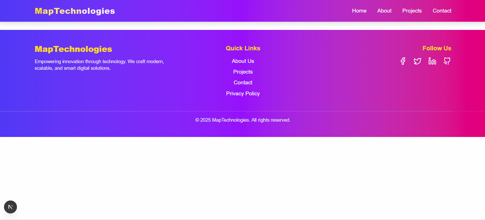

# 🚀 MapTechnologies Hacktoberfest 2025

Welcome to the **MapTechnologies Hacktoberfest 2025** project! This is a modern, responsive web application built with Next.js and designed to showcase innovative digital solutions while providing an excellent platform for open-source contributions during Hacktoberfest.

## 🌟 Project Overview

This is a [Next.js](https://nextjs.org) project bootstrapped with [`create-next-app`](https://nextjs.org/docs/app/api-reference/cli/create-next-app), featuring a clean, modern design with beautiful gradients and animations.

### ✨ Key Features

- 🎨 **Modern UI/UX**: Beautiful gradient backgrounds and smooth animations using AOS (Animate On Scroll)
- 📱 **Fully Responsive**: Mobile-first design that works perfectly on all devices
- 🔧 **Next.js 15**: Built with the latest Next.js App Router for optimal performance
- 🎯 **TypeScript**: Type-safe development for better code quality
- 🎭 **Tailwind CSS**: Utility-first CSS framework for rapid styling
- 🧩 **Component-Based**: Modular, reusable React components
- 🌐 **Navigation System**: Responsive navbar with mobile menu support
- 📄 **Dynamic Routing**: Organized page structure with Next.js routing
- 🎪 **Interactive Elements**: Hover effects and transitions for better UX
- 🔗 **Social Integration**: Footer with social media links

### 🛠️ Tech Stack

- **Frontend**: Next.js 15, React 18, TypeScript
- **Styling**: Tailwind CSS, CSS Modules
- **Animations**: AOS (Animate On Scroll)
- **Icons**: Lucide React
- **Fonts**: Geist Sans & Geist Mono
- **Development**: ESLint, PostCSS

## 🎥 Project Demo

Here’s a quick look at the project in action 👇  



## Getting Started

First, run the development server:

```bash
npm run dev
# or
yarn dev
# or
pnpm dev
# or
bun dev
```

Open [http://localhost:3000](http://localhost:3000) with your browser to see the result.

You can start editing the page by modifying `app/page.tsx`. The page auto-updates as you edit the file & add more components folder and add component.

This project uses [`next/font`](https://nextjs.org/docs/app/building-your-application/optimizing/fonts) to automatically optimize and load [Geist](https://vercel.com/font), a new font family for Vercel.


## Installation Steps

1. Clone the repository:
   ```bash
   git clone https://github.com/umarhasnain/maptechnologies-hacktoberfest-2025.git
   ```

2. Move into the project directory:
   ```bash
   cd maptechnologies-hacktoberfest-2025
   ```

3. Install dependencies:
   ```bash
   npm install
   ```

4. Run the development server:
   ```bash
   npm run dev
   ```

5. Open your browser and go to:
   ```bash
   http://localhost:3000
   ```

✅ Now the project should be running successfully!

## 🧑‍💻 Contributor Instructions

We welcome contributions! Follow these simple steps to contribute:

- Fork this repository and clone it locally.  
- Create a new branch for your changes (`git checkout -b your-branch-name`).  
- Make your updates and commit them with clear messages.  
- Push your branch and open a Pull Request. 🚀


## ⚙️ Tech Stack

- **Next.js** – React framework for building web apps  
- **React** – UI library  
- **Node.js & npm** – Runtime and package manager  
- **CSS / Tailwind / Geist Font** – Styling and font optimization  
- **Vercel** – Deployment platform


## ❓ Frequently Asked Questions (FAQ)

### 1. I ran `npm install` but get errors. What should I do?
- Make sure you have the latest version of Node.js installed (v18 or above recommended).  
- Delete the `node_modules` folder and `package-lock.json` file, then run:
```bash
npm install
```

### 2. `npm run dev` doesn’t start the server.
- Ensure no other process is using port `3000`.  
- You can try running on a different port:
```bash
npm run dev -- -p 3001
```


---

```markdown
### 3. The page doesn’t auto-refresh when I make changes.
- Make sure you are editing files inside the `app` or `components` folder.  
- Check if your browser has caching issues; try a hard refresh (`Ctrl + Shift + R` or `Cmd + Shift + R`).  
- Restart the development server if hot reloading fails.

### 4. I’m seeing font-related issues.
- This project uses the **Geist font** via `next/font`. Make sure your internet connection allows font downloads.  
- Try clearing the `.next` cache and restarting:
```bash
rm -rf .next
npm run dev
```

### 5. Can I use `bun` or `pnpm` instead of npm?
Yes! The project supports multiple package managers. Just make sure to use the equivalent commands:  
- `pnpm install` → `pnpm dev`  
- `bun install` → `bun dev`

### 6. I want to contribute but don’t know where to start.
- Look for issues labeled `good first issue` in the GitHub repository.  
- Start by adding or improving components in the `components` folder.  
- Follow the **Contributor Instructions** section in this README.

## Learn More

To learn more about Next.js, take a look at the following resources:

- [Next.js Documentation](https://nextjs.org/docs) - learn about Next.js features and API.
- [Learn Next.js](https://nextjs.org/learn) - an interactive Next.js tutorial.

You can check out [the Next.js GitHub repository](https://github.com/vercel/next.js) - your feedback and contributions are welcome!

## Deploy on Vercel

The easiest way to deploy your Next.js app is to use the [Vercel Platform](https://vercel.com/new?utm_medium=default-template&filter=next.js&utm_source=create-next-app&utm_campaign=create-next-app-readme) from the creators of Next.js.

Check out our [Next.js deployment documentation](https://nextjs.org/docs/app/building-your-application/deploying) for more details.


